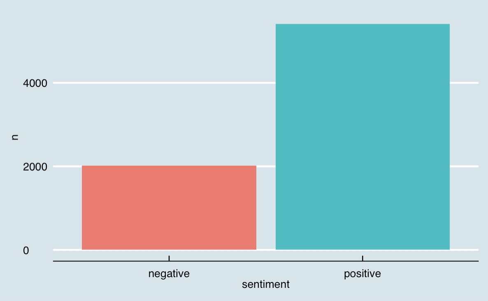

# Social Media Sentiment Analysis

## Overview:
A sentimental analysis conducted on the most sentimental person (Just for fun)

## Data Source
1. Twitter: You can apply for API at [Twitter For Developer](https://developer.twitter.com/en/docs)
2. Instagram no longer provides public API. I used the automatic scraper developed by [APIFY](https://apify.com/) instead.

## First Try:
>Because Twitter would automatically repost his Instagram posts，Twitter has public API, and IG doesn't

>First I decided to just analyze on his Twitter posts to avoid the complication of dealing with mannually scrapying from Instagram.
>However, after I got the data from Twitter's API, I realized twitter don't always repost the complete text. Many long posts are replaced by a hyperlink redirecting readers to original posts, which caused error in my analysis results.

>So, I have to go with the original posts on Instagram.

## Analysis
### Posts length 
Posts Length in characters
  '''
  nchar(tweets$text)
  '''
> Posts Length in words
> Posts Length in sentences
> Posts Length in characters

### Screaming and Exclamation mark, and for what？
 

>> He's obviously so excited about this astrophysics conference that he used 28 exclamation marks in the post. I'm not surprised.

### Most Common Words 

>> Thanks is the most common word. Gratitude is the attitude!

### Emotion distribution

### Which Emotions are most liked by followers?

>> Seems his followers like it most when he is joyful, hopeful and positive. Social media, I'm glad to see "there are still faint glimmers of civilization left in this barbaric slaughterhouse that was once known as humanity."

### Comparison Word Cloud

